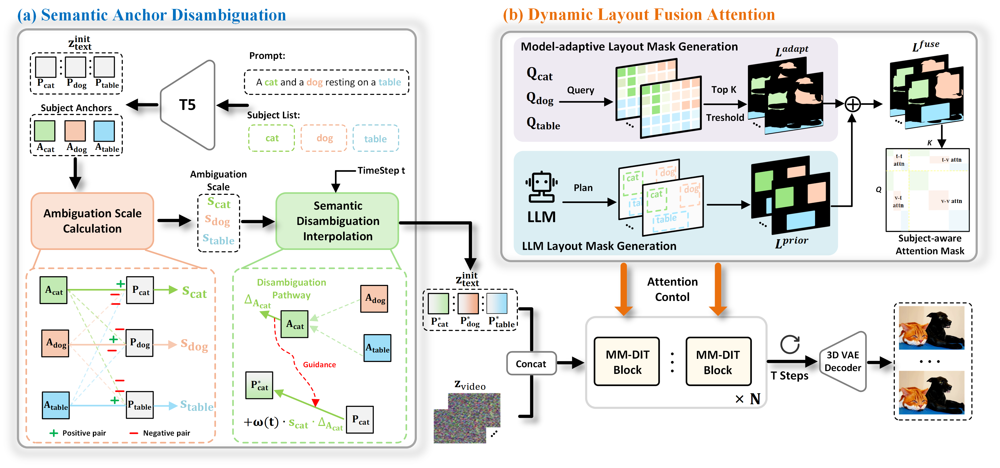

# MagicComp: Training-free Dual-Phase Refinement for Compositional Video Generation
<a href='https://hong-yu-zhang.github.io/MagicComp-Page/'></a> <a href='https://arxiv.org/abs/2412.04440'></a> 

**Code will come soon.**

## Motivation
<br>

<br>

## Method Overview
<br>

<br>

## Citation
If you find **MagicComp** useful, please cite our paper:
```
@misc{zhang2025magiccomptrainingfreedualphaserefinement,
      title={MagicComp: Training-free Dual-Phase Refinement for Compositional Video Generation}, 
      author={Hongyu Zhang and Yufan Deng and Shenghai Yuan and Peng Jin and Zesen Cheng and Yian Zhao and Chang Liu and Jie Chen},
      year={2025},
      eprint={2503.14428},
      archivePrefix={arXiv},
      primaryClass={cs.CV},
      url={https://arxiv.org/abs/2503.14428}, 
}
```
